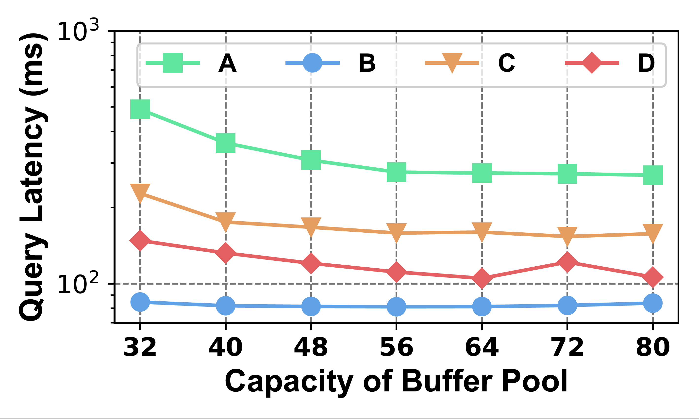
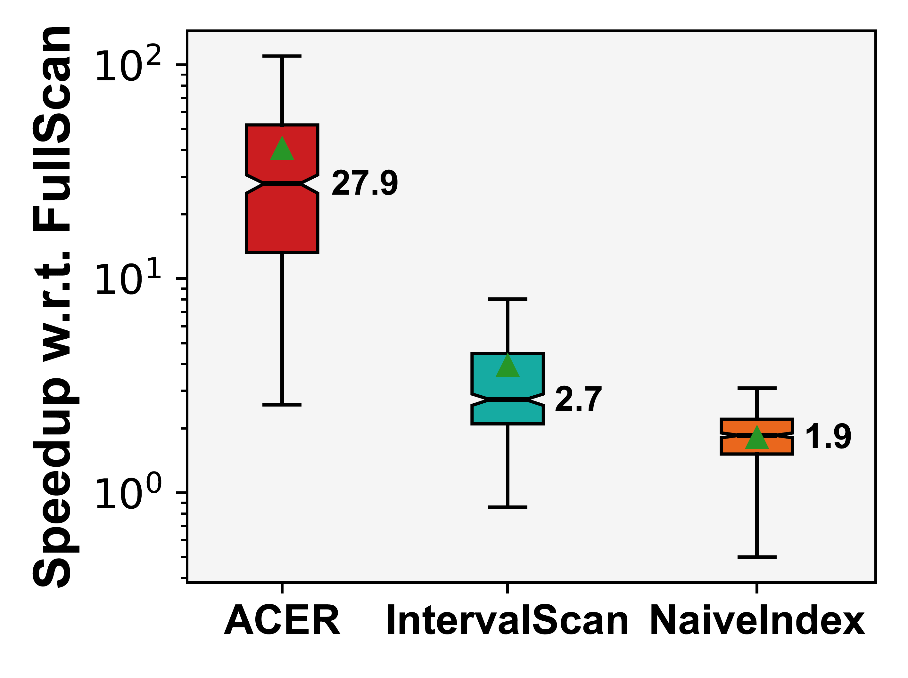

# 论文画图代码示例

配色真的很重要,下面给出了三个非常好看的图例配色

|Example1|Example2|Example3|
|-|-|-|
||||

推荐一些个人常用的配色网站
- [ColorHexa](https://www.colorhexa.com):提供配色方案、颜色信息和应用建议（选定颜色再丢这个网站看看它建议什么色）
- [coolors](https://coolors.co/)拥有非常简单美观的配色界面,在点击配色按钮之后,需按空格键就会随机展示不同的配色方案

### 1.柱状图
1.下图展示了配色好的柱状图[Code](/bar_figure+.ipynb)

### 2.折线图
下图展示了配色好的折线图[Code](/line_figure.ipynb)

### 3.箱型图
下图展示了配色好的箱型图[Code](/box_figure.ipynb)

